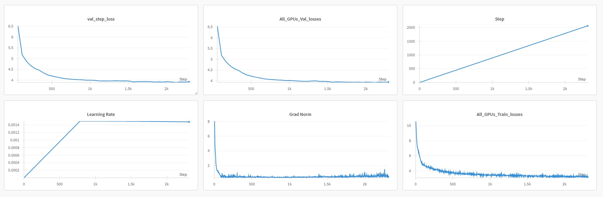

# Introducing SmolWhisper - A Small ASR Model  

- So, I trained a Whisper model a ~30M (whisper tiny.en) architecture I coded from ground up to build a small ASR model, going through the below-mentioned stage from scratch.
- Trained on GigaSpeech dataset form HuggingFace consisting of 250 hours of clean audio for a total of full 3 epochs


### 1) Pretraining


#### Dataset

 - I used the [GigaSpeech]([https://huggingface.co/datasets/HuggingFaceFW/fineweb?row=0](https://huggingface.co/datasets/speechcolab/gigaspeech)) dataset from HuggingFace ('s' checkpoint) consisting of roughly 250 hrs.

  1) Train dataset - 200k rows
  2) Val dataset - 4k rows


---

####  ModelArgs (Hyperparameters)

## Core Architecture
| Parameter               | Description                     | Default Value |
|-------------------------|---------------------------------|---------------|
| `block_size`            | Context window length          | 64            |
| `embeddings_dims`       | Hidden dimension size          | 512           |
| `no_of_heads`          | Attention heads                | 4             |
| `no_of_decoder_layers` | Transformer layers             | 6             |
| `tgt_vocab_size`       | Vocabulary size                | 32768|

## Audio Processing
| Parameter               | Description                     | Default Value |
|-------------------------|---------------------------------|---------------|
| `log_mel_features`     | Mel filterbank channels        | 80            |
| `kernel_size`          | Convolution kernel size        | 3             |
| `stride`               | Conv stride (time,freq)        | (2,10)        |
| `SAMPLING_RATE`        | Audio sample rate (Hz)         | 16000         |
| `WINDOW_DURATION`      | STFT window (seconds)          | 0.025         |
| `STRIDE_DURATION`      | STFT hop (seconds)             | 0.010         |

## Training Setup
| Parameter               | Description                     | Default Value |
|-------------------------|---------------------------------|---------------|
| `batch_size`           | Per-GPU batch size             | 256           |
| `total_batch_size`     | Global batch size              | 32768         |
| `epochs`              | Training epochs                | 2             |

## Optimization
| Parameter               | Description                     | Default Value |
|-------------------------|---------------------------------|---------------|
| `max_lr`              | Peak learning rate             | 1.5e-3        |
| `min_lr`              | Minimum learning rate          | 3e-6          |
| `weight_decay_optim`  | AdamW weight decay             | 0.1           |
| `clip`                | Gradient clipping              | 1.0           |
| `warmup_iters`        | LR warmup steps                | 700           |

## Advanced Features
| Parameter               | Description                     | Default Value |
|-------------------------|---------------------------------|---------------|
| `use_flash_attention`  | Enable FlashAttention          | True          |
| `use_liger`            | Use LIGER optimizations        | True          |
| `dtype`                | Floating precision             | bfloat16      |

---
### Hardware Setup

 - Used DPP using Pytorch torchrun consisting of 2x A100s SXM (80GB VRAM each) rented on runpod.io

---

#### Frameworks:
**Pytorch**

--- 

#### Epochs/Steps
- Epochs (train) = 3 (gradient accumulation of 1)

- Val iterations = every 50 steps
---

#### Losses

 - Result - Pretraining  

   Train loss: 3.16  
   Val Loss: 3.93  


---

#### Screenshots of the loss curves

- Pretrain



--- 

### Local setup


### Requirements


```python
git [clone the repo](https://github.com/YuvrajSingh-mist/SmolWhisper.git)
cd SmolWhisper
bash ./install.sh

```
- A wandb.ai account for plotting graphs for your loss curves

- On your terminal run
```python
wandb login
```

- Enter the api key and follow the instructions and once you are succesfully logged in follow the given steps


---

### Running 


#### Training a model

- Kindly hange 'device' to any of your available cuda gpus.

To run:

```python
cd SmolWhisper
```

Prepare the dataset (gigaspeech)

```python

python data.py 


```

```python
bash ./install.sh
```


Train the model

Now run the following command 

```python
torchrun --standalone --nproc_per_node=gpu trainer.py \  
   --epochs 4 \
--block_size 256 \
--batch_size 128 \
--embeddings_dims 512 \
--attn_dropout 0.1 \
--no_of_heads 8 \
--dropout 0.1 \
--val_epochs 2 \
--max_lr 6e-4 \
--no_of_decoder_layers 16 \
--weight_decay_optim 0.1 \
--beta_1 0.9 \
--beta_2 0.95 \
--clip 1.0 \
--device cuda \
--vocab_size 50304 \
--eps 1e-5 \
--dtype "bfloat16" \
--save_checkpoint_dir "checkpoints" \
--prompt "Once upon a time" \
--save_checkpoint_iter 50 \
--total_iters 20000 \
--eval_iters 50 \
--eval_check 100 \
--warmup_iters 700 \
--min_lr 6e-5 \
--lr_decay_iters 20000 \
--total_batch_size 524288 \
--micro_batch_size 128 \
--gradient_accumulation_steps 4096 \
--experts 8 \
--top_experts 2 \
--use_flash_attention True \
--use_liger True \
--use_compile False \
--use_checkpointing False \
--noisy_topk True
```


#### Inference on a pretrained model

 
```python
python inference.py --audio_path "YOUR_PATH_HERE" --max_length 128 --temperature 0.8  --model_path "TRAINED_MODEL_PATH_HERE"
```


